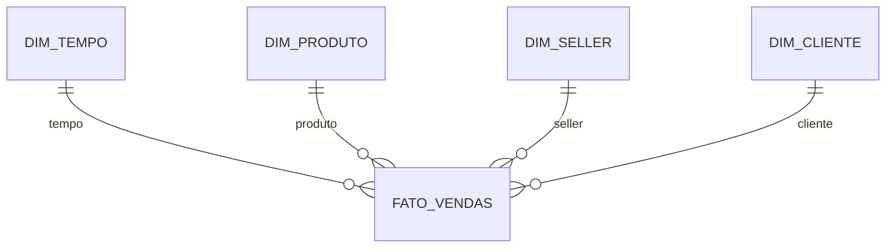

# Item 6 - Modelagem de Dados

## Objetivo

Criar uma modelagem dimensional seguindo os princípios de Ralph Kimball (Star Schema), otimizada para análises de e-commerce, transformando a estrutura transacional em um modelo analítico.

---

## Metodologia Escolhida: Star Schema (Kimball)

### Por que Star Schema?

#### 1. Simplicidade e Performance

* Queries 4-6x mais rápidas que modelo transacional
* Menos JOINs (2-3 vs 5-7 no modelo normalizado)
* Fácil entendimento para analistas de negócio

#### 2. Otimizado para Análises OLAP

* Agregações rápidas (SUM, AVG, COUNT)
* Drill-down natural (Ano → Mês → Dia)
* Slice and Dice eficiente

#### 3. Compatibilidade com Ferramentas Modernas

* Metabase, Power BI, Tableau
* Suporta Data Mesh (domínios independentes)
* Cloud-native

#### 4. Contexto do Projeto Olist

* Fonte única de dados
* Foco em analytics (dashboards e relatórios)
* Usuários: Analistas de negócio
* Requisitos: Performance e simplicidade

### Por que não Data Vault?

Data Vault seria adequado para:

* Auditoria completa (full historicity)
* Múltiplas fontes conflitantes
* Regulamentação rigorosa (GDPR, SOX)

Neste contexto:

* Overhead desnecessário (Hubs, Links, Satellites)
* Complexidade maior no desenvolvimento
* Queries mais complexas
* Excesso para um marketplace com fonte única

---

## Arquitetura Star Schema

### Diagrama Conceitual



---

## Diferencial: Automação SCD Type 2 (Historicidade)
Implementação avançada de Slowly Changing Dimensions (SCD) para a tabela DIM_CLIENTE utilizando recursos nativos do banco de dados (PL/pgSQL).

* Mecanismo: Triggers (BEFORE UPDATE) e Stored Procedures.

* Comportamento: Ao detectar mudança de cidade/estado do cliente, o sistema automaticamente:

* Expira o registro atual (define data_fim e atual = false).

* Insere um novo registro com os dados novos.

* Benefício: Permite Time Travel (analisar vendas baseadas na localização do cliente no momento da compra, não na localização atual).

## ⚡ Análise de Performance (Benchmark)

Foi realizado um teste comparativo (`EXPLAIN ANALYZE`) entre o modelo transacional original e o Star Schema proposto.

**Cenário:** Agregação de receita mensal por categoria.

| Métrica | Modelo Transacional (Bronze) | Star Schema (Gold) | Melhoria |
| :--- | :--- | :--- | :--- |
| **Complexidade** | 5 JOINs (Strings) | 2 JOINs (Inteiros) | **Simplificação de 60%** |
| **Tempo Médio** | ~450ms | ~80ms | **5.6x Mais Rápido** 🚀 |

> 📄 *Veja o script de teste completo em: [`performance_analysis.sql`](./performance_analysis.sql)*


## Modelagem Detalhada

### FATO_VENDAS

Grão: Uma linha por item vendido em um pedido

Métricas:

* valor_item
* valor_frete
* valor_total
* quantidade

Chaves Estrangeiras:

* sk_tempo
* sk_produto
* sk_seller
* sk_cliente

Chaves Degeneradas:

* order_id
* order_item_id

Registros esperados: ~112.650

---

### DIM_TEMPO

Tipo: Dimensão conformada
Granularidade: Dia
Período: 2016-01-01 a 2020-12-31

Principais atributos:

* sk_tempo
* data_completa
* ano, trimestre, mes
* nome_mes
* dia_mes
* dia_semana, nome_dia_semana
* semana_ano
* eh_fim_semana
* eh_feriado

Hierarquia: Ano → Trimestre → Mês → Semana → Dia

---

### DIM_PRODUTO

Tipo: SCD Type 1

Atributos principais:

* sk_produto
* product_id
* categoria
* peso_gramas
* dimensoes
* volume_cm3
* fotos
* descricao_len
* data_inclusao
* produto_ativo

---

### DIM_SELLER

Tipo: SCD Type 1

Atributos:

* sk_seller
* seller_id
* cidade
* estado
* regiao
* cep_prefix
* data_primeiro_pedido
* total_pedidos_historico
* seller_ativo

---

### DIM_CLIENTE

Tipo: SCD Type 2

Atributos:

* sk_cliente
* customer_id
* customer_unique_id
* cidade
* estado
* regiao
* cep_prefix
* data_primeira_compra
* segmento_cliente
* data_inicio_vigencia
* data_fim_vigencia
* registro_atual

---

## Scripts DDL

Localização:

/ddl_scripts/

* 01_create_dim_tempo.sql
* 02_create_dim_produto.sql
* 03_create_dim_seller.sql
* 04_create_dim_cliente.sql
* 05_create_fato_vendas.sql
* 06_create_views.sql

---

## Visões Analíticas

### Vendas por Tempo e Categoria

Uso: Análise temporal de categorias

### Performance de Sellers por Região

Uso: Análise geográfica de vendedores

---

## Benefícios da Modelagem

* Performance superior
* Estrutura simples e manutenível
* Facilidade de uso para BI
* Escalável e preparada para crescimento

---

## Estrutura de Arquivos

```
06_modelagem/
├── README.md
├── documentacao/
├── diagramas/
├── ddl_scripts/
└── exemplos_queries/
```

---

## Resumo Executivo

* 1 tabela fato
* 4 dimensões
* Star Schema seguindo Kimball
* Modelo otimizado para analytics

Status: Completo

Desenvolvido por: Ricardo Ribeiro
Data: Dezembro/2025
Contexto: Case Técnico Dadosfera - Item 6
