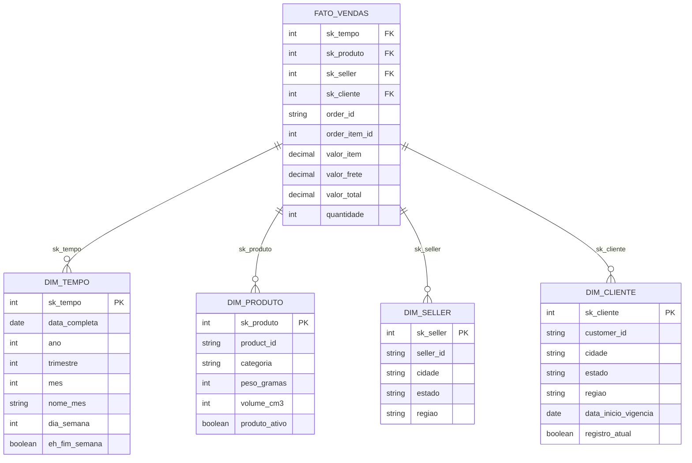

```mermaid
erDiagram

    FATO_VENDAS ||--o{ DIM_TEMPO : sk_tempo
    FATO_VENDAS ||--o{ DIM_PRODUTO : sk_produto
    FATO_VENDAS ||--o{ DIM_SELLER : sk_seller
    FATO_VENDAS ||--o{ DIM_CLIENTE : sk_cliente

    FATO_VENDAS {
        int sk_tempo FK
        int sk_produto FK
        int sk_seller FK
        int sk_cliente FK
        string order_id
        int order_item_id
        decimal valor_item
        decimal valor_frete
        decimal valor_total
        int quantidade
    }

    DIM_TEMPO {
        int sk_tempo PK
        date data_completa
        int ano
        int trimestre
        int mes
        string nome_mes
        int dia_semana
        boolean eh_fim_semana
    }

    DIM_PRODUTO {
        int sk_produto PK
        string product_id
        string categoria
        int peso_gramas
        int volume_cm3
        boolean produto_ativo
    }

    DIM_SELLER {
        int sk_seller PK
        string seller_id
        string cidade
        string estado
        string regiao
    }

    DIM_CLIENTE {
        int sk_cliente PK
        string customer_id
        string cidade
        string estado
        string regiao
        date data_inicio_vigencia
        boolean registro_atual
    }
```