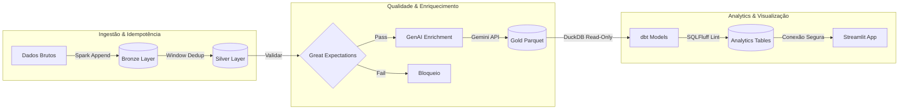

# Olist Modern Data Platform (Enterprise Edition)


**Autor:** Ricardo Ribeiro
**Arquitetura:** Modern Data Stack (Containerized Lakehouse)
**Infraestrutura:** Docker Compose (PostgreSQL, Prefect Server, Spark Workers)

---

## Sobre o Projeto (V2.0)

Esta não é apenas uma pipeline de dados; é uma **Plataforma de Engenharia de Dados** completa, resiliente e observável.

O projeto simula um ambiente corporativo real, onde falhas de rede, execuções duplicadas e segurança de credenciais são tratados nativamente pela arquitetura.

### Diferenciais de Engenharia

* **Idempotência Real**
  O pipeline pode rodar múltiplas vezes sem duplicar dados. Utiliza ingestão append-only na Bronze e deduplicação via Window Functions na Silver.

* **Segurança Zero-Trust**
  Nenhuma credencial versionada. Toda a configuração é gerenciada via Pydantic Settings e variáveis de ambiente.

* **Observabilidade**
  Logs estruturados em JSON e relatórios de performance (Artifacts) gerados automaticamente na UI do Prefect.

* **Code Quality**
  SQL validado e padronizado via SQLFluff e dados testados com Great Expectations.

* **Escalabilidade**
  Spark configurado com OffHeap Memory e particionamento inteligente (Ano/Mês) no Data Lake.

---

## Quick Start (Produção via Docker)

A plataforma é totalmente containerizada. O Docker gerencia Spark, PostgreSQL, Prefect, dbt e serviços auxiliares.

### 1. Configuração de Segurança

Crie o arquivo de variáveis de ambiente:

```bash
cp .env.example .env
```

Edite o arquivo `.env` e insira sua `GOOGLE_API_KEY`.

---

### 2. Subir a Infraestrutura

```bash
docker compose up --build -d
```

---

### 3. Acessar os Serviços

* Orquestrador (Prefect UI): [http://localhost:4200](http://localhost:4200)
* Data App (Streamlit): [http://localhost:8501](http://localhost:8501)

---

## Arquitetura Técnica

O fluxo segue a arquitetura Medallion (Bronze, Silver, Gold), enriquecida com camadas de Governança e IA.



---

## Estrutura do Projeto

| Diretório / Arquivo    | Função                              | Tecnologias Chave         |
| ---------------------- | ----------------------------------- | ------------------------- |
| `src/orchestration/`   | Definição dos Flows e Deployments   | Prefect, Pydantic         |
| `src/etl/`             | Lógica Spark (Ingestão e Limpeza)   | PySpark, Window Functions |
| `src/observability.py` | Logs estruturados e métricas        | Python JSON Logger        |
| `dbt_project/`         | Transformações SQL (Gold Layer)     | dbt-duckdb, SQLFluff      |
| `09_lakehouse/`        | Armazenamento local de dados        | Parquet (Partitioned)     |
| `docs/`                | Documentação e Data Quality Reports | Great Expectations        |

---

## Camadas Analíticas (dbt)

| Camada  | Tipo                | Descrição                                                                       |
| ------- | ------------------- | ------------------------------------------------------------------------------- |
| Staging | View                | Limpeza leve, renomeação de colunas e casting de tipos (ex: `stg_order_items`). |
| Marts   | Incremental / Table | Tabelas fato e dimensão prontas para consumo analítico e ferramentas de BI.     |

---

## Decisões Arquiteturais

### 1. Por que Idempotência na Aplicação?

Data Lakes não possuem constraints nativas como bancos transacionais.

A lógica de snapshot é aplicada na camada Silver. O histórico da Bronze é ordenado por `ingestion_at` e apenas o registro mais recente por entidade é mantido.

---

### 2. Por que DuckDB com `read_only = true`?

DuckDB é um banco em arquivo. Escritas simultâneas com leituras podem causar database lock.

O Streamlit conecta em modo somente leitura, ativando MVCC e permitindo pipelines em execução sem impactar o consumo analítico.

---

### 3. Por que SQLFluff?

SQL é código. Código sem padrão vira dívida técnica.

O SQLFluff roda no CI/CD e bloqueia commits com joins sem alias, referências ambíguas e padrões fora do style guide.

---

## Evidências de Execução

### Observabilidade (Prefect Artifacts)

| Estágio | Status | Linhas  | Duração | Throughput |
| ------- | ------ | ------- | ------- | ---------- |
| Bronze  | OK     | 112.650 | 4.2s    | 26k/s      |
| Silver  | OK     | 112.650 | 8.5s    | 13k/s      |

---

### Data Quality

Relatórios HTML do Great Expectations disponíveis em:

```text
docs/data_quality/
```

---

<div align="center">
  <h3>Desenvolvido por Ricardo Ribeiro</h3>
  <p>Engenheiro de Dados • Enterprise Data Architecture</p>
</div>
