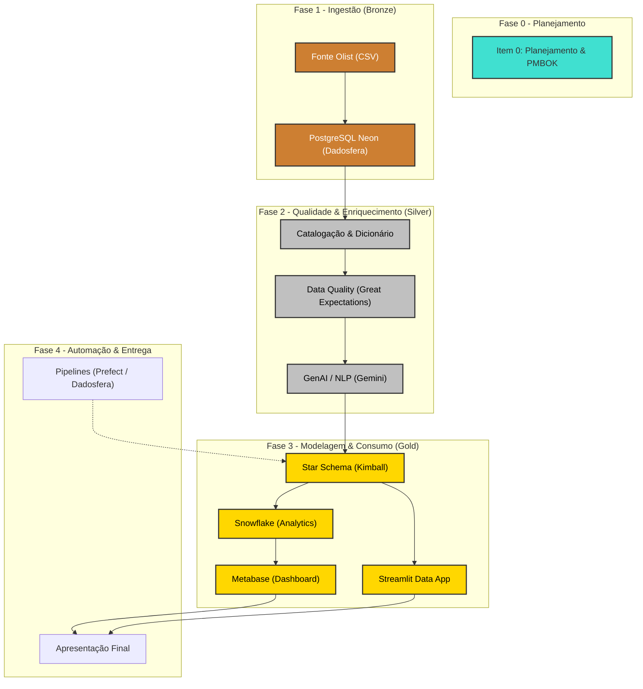

# Case Técnico Dadosfera – Engenharia de Dados


**Autor:** Ricardo Ribeiro  
**Data:** Dezembro/2025  
**Contexto:** Implementação de Plataforma de Dados End-to-End para E-commerce

---

## Visão Geral

Este projeto adota uma abordagem híbrida (**Modern Data Stack**), combinando planejamento estruturado com entregas incrementais. O objetivo foi transformar dados brutos de e-commerce em dados analíticos confiáveis, governados e prontos para consumo, cobrindo ingestão, qualidade, modelagem, analytics e automação.

---

## Apresentação do Case (Item 10)

* Link para apresentação executiva (5–7 minutos)

---

## Fase 0 – Planejamento

**Objetivo:** Definir escopo, estrutura do repositório, metodologia ágil e riscos do projeto.

| ID | Atividade             | Status    | Entrega                                     |
| -- | --------------------- | --------- | ------------------------------------------- |
| 00 | Planejamento e Kanban | Concluído | Metodologia Ágil e Estrutura do Repositório |

---

## Fase 1 – Bronze (Ingestão)

**Objetivo:** Garantir aquisição, persistência e rastreabilidade dos dados brutos.

**Fonte:** Brazilian E-Commerce Public Dataset by Olist (>100k pedidos)

| ID | Atividade                                   | Status    | Dependência |
| -- | ------------------------------------------- | --------- | ----------- |
| 01 | Seleção e Aquisição da Base Olist           | Concluído | 00          |
| 02 | Ingestão via PostgreSQL (Neon) na Dadosfera | Concluído | 01          |

---

## Fase 2 – Silver (Qualidade e Enriquecimento)

**Objetivo:** Garantir consistência, qualidade dos dados e enriquecimento semântico.

| ID | Atividade                                | Status    | Dependência |
| -- | ---------------------------------------- | --------- | ----------- |
| 03 | Catalogação e Dicionário de Dados        | Concluído | 02          |
| 04 | Data Quality com Great Expectations      | Concluído | 03          |
| 05 | GenAI – Enriquecimento com Google Gemini | Concluído | 01, 02      |

---

## Fase 3 – Gold (Modelagem e Consumo)

**Objetivo:** Disponibilizar dados analíticos prontos para BI e produtos de dados.

| ID | Atividade                                     | Status    | Dependência |
| -- | --------------------------------------------- | --------- | ----------- |
| 06 | Modelagem Dimensional – Star Schema (Kimball) | Concluído | 04, 05      |
| 07 | Dashboard Analítico (Metabase + Snowflake)    | Concluído | 06          |
| 09 | Data App – Streamlit Interativo               | Concluído | 07          |

---

## Fase 4 – Automação

**Objetivo:** Garantir reprodutibilidade, orquestração e confiabilidade dos pipelines.

| ID | Atividade                           | Status    | Dependência |
| -- | ----------------------------------- | --------- | ----------- |
| 08 | Pipelines Automatizados com Prefect | Concluído | 06          |

---

## Testes Automatizados

O projeto conta com uma suíte robusta de testes utilizando **pytest**:

* **Unit Tests:** Verificam a lógica isolada de cada função.
* **Integration Tests:** Simulam a execução completa do pipeline (Leitura → Transformação → Escrita).

### Como executar

```bash
pytest tests/ -v
```

---

## Diagrama de Arquitetura

O fluxo de dados segue uma arquitetura **Lakehouse**, com ingestão transacional via **PostgreSQL (Neon)** na plataforma **Dadosfera**, camada analítica em **Snowflake** e visualização via **Metabase**.


```mermaid
graph TD

    classDef plan fill:#40e0d0,stroke:#333,stroke-width:2px;
    classDef bronze fill:#cd7f32,stroke:#333,stroke-width:2px,color:white;
    classDef silver fill:#c0c0c0,stroke:#333,stroke-width:2px,color:black;
    classDef gold fill:#ffd700,stroke:#333,stroke-width:2px,color:black;

    subgraph Planejamento["Fase 0 - Planejamento"]
        P0["Item 0: Planejamento & PMBOK"]:::plan
    end

    subgraph Bronze["Fase 1 - Ingestão (Bronze)"]
        B1["Fonte Olist (CSV)"]:::bronze
        B2["PostgreSQL Neon (Dadosfera)"]:::bronze
        B1 --> B2
    end

    subgraph Silver["Fase 2 - Qualidade & Enriquecimento (Silver)"]
        S1["Catalogação & Dicionário"]:::silver
        S2["Data Quality (Great Expectations)"]:::silver
        S3["GenAI / NLP (Gemini)"]:::silver
        B2 --> S1
        S1 --> S2
        S2 --> S3
    end

    subgraph Gold["Fase 3 - Modelagem & Consumo (Gold)"]
        G1["Star Schema (Kimball)"]:::gold
        G2["Snowflake (Analytics)"]:::gold
        G3["Metabase (Dashboard)"]:::gold
        G4["Streamlit Data App"]:::gold
        S3 --> G1
        G1 --> G2
        G2 --> G3
        G1 --> G4
    end

    subgraph Automacao["Fase 4 - Automação & Entrega"]
        A1["Pipelines (Prefect / Dadosfera)"]
        A2["Apresentação Final"]
        A1 -.-> G1
        G3 --> A2
        G4 --> A2
    end
```

**Observação:** A ingestão ocorre via PostgreSQL (Neon) na plataforma Dadosfera. A camada Gold é consumida no Snowflake, que atua como engine analítica para construção dos dashboards no Metabase.

---

## Tech Stack & Estrutura do Repositório

* `00_planejamento/` – Metodologia ágil, Kanban e planejamento
* `01_base_dados/` – Datasets brutos e dicionário de dados
* `04_data_quality/` – Validação com Great Expectations
* `05_genai_llm/` – Notebooks de NLP e LLM (Google Gemini)
* `06_modelagem/` – Modelagem dimensional, DDLs e diagramas
* `07_analise_visualizacao/` – Dashboards, KPIs e queries analíticas
* `08_pipelines/` – Orquestração e automação (Prefect / Dadosfera)
* `09_data_app/` – Aplicação interativa em Streamlit

---

## Análise de Riscos Mitigados

* **Rate Limit de API (GenAI):** Mitigado com backoff exponencial e uso do modelo Gemini Flash
* **Qualidade dos Dados:** Bloqueio de pipelines com Great Expectations (fail-fast)
* **Segurança:** Credenciais gerenciadas via variáveis de ambiente (não versionadas)
  
---

<div align="center">
  <h3>Desenvolvido por Ricardo Ribeiro</h3>
  <p>Case Técnico Dadosfera • Dezembro/2025</p>
</div>
