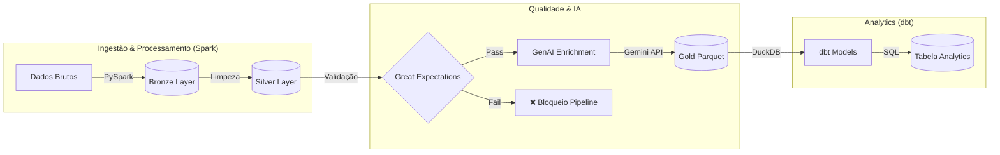

# Olist Modern Data Platform (Enterprise Edition)


**Autor:** Ricardo Ribeiro  
**Arquitetura:** Modern Data Stack (Containerized Lakehouse)  
**Infraestrutura:** Docker Compose (PostgreSQL, Prefect Server, Spark Jobs)

---

## Quick Start (Produção via Docker)

Esta é uma plataforma de dados completa, containerizada e pronta para execução. Não é necessário instalar Java, Spark ou Python localmente; o **Docker** gerencia todo o ciclo de vida.

### Pré-requisitos
1.  **Docker** e **Docker Compose** instalados.
2.  Arquivo `.env` na raiz com sua chave:
    ```env
    GOOGLE_API_KEY="sua_chave_aqui"
    ```

### Como Rodar
Basta um único comando para subir a infraestrutura (Postgres + Prefect) e rodar o pipeline:

```bash
docker-compose up --build
```

---
## O que acontece nos bastidores?
1. Infraestrutura: Sobe um banco PostgreSQL (para metadados) e o Prefect Server.

2. Wait-for-it: O container de ETL aguarda o servidor estar saudável (Healthcheck).

3. Pipeline: O script flow_main.py executa sequencialmente:

 * Ingestão (Bronze): Leitura de CSVs e conversão para Parquet.

 * Refinamento (Silver): Limpeza e tipagem com PySpark.

 * Qualidade (Quality Gate): Validação com Great Expectations. Se os dados estiverem ruins, o pipeline para.

 * Enriquecimento (AI): O Google Gemini gera descrições de marketing para os produtos.

 * Analytics (Gold): O dbt modela a tabela final de Vendas Mensais.

 ---

## Estrutura do Projeto

Abaixo está o mapeamento das fases do pipeline, tecnologias utilizadas e os caminhos clicáveis no repositório:

| ID | Fase                 | Tecnologia         | Onde está o código?                          |
| -- | -------------------- | ------------------ | -------------------------------------------- |
| 00 | Planejamento         | Kanban / Agile     | [`./00_planejamento`](./00_planejamento)     |
| 01 | Ingestão (Bronze)    | PySpark            | [`./src/etl`](./src/etl)                     |
| 02 | Refinamento (Silver) | PySpark            | [`./src/etl`](./src/etl)                     |
| 03 | Qualidade (DQ)       | Great Expectations | [`./src/orchestration`](./src/orchestration) |
| 04 | Analytics (Gold)     | dbt + DuckDB       | [`./olist_analytics`](./olist_analytics)     |
| 05 | Orquestração         | Prefect            | [`./src/orchestration`](./src/orchestration) |
| 06 | Data Lake            | Parquet Files      | [`./09_lakehouse`](./09_lakehouse)           |

---

## Arquitetura da Solução
O fluxo segue a arquitetura Medallion, enriquecida com camadas de Qualidade (Data Contracts) e Inteligência Artificial.


```mermaid
graph LR
    subgraph "Ingestão & Processamento (Spark)"
        A[Dados Brutos] -->|PySpark| B[(Bronze Layer)]
        B -->|Limpeza| C[(Silver Layer)]
    end

    subgraph "Qualidade & IA"
        C -->|Validação| GX{Great Expectations}
        GX -->|Pass| AI[GenAI Enrichment]
        GX -->|Fail| Stop[❌ Bloqueio Pipeline]
        AI -->|Gemini API| D[(Gold Parquet)]
    end

    subgraph "Analytics (dbt)"
        D -->|DuckDB| E[dbt Models]
        E -->|SQL| F[(Tabela Analytics)]
    end
```

---

## 🛠️ Tech Stack & Decisões Arquiteturais

A tabela abaixo resume as principais tecnologias adotadas no projeto, categorizadas por função e com justificativas alinhadas a padrões **enterprise-ready**:

| Tecnologia         | Categoria      | Justificativa "Enterprise"                                                                                                                                 |
| ------------------ | -------------- | ---------------------------------------------------------------------------------------------------------------------------------------------------------- |
| Docker Compose     | Infraestrutura | Isola o ambiente de execução e garante reprodutibilidade entre desenvolvimento e produção, eliminando conflitos de dependências (Python/Java).             |
| PostgreSQL         | Database       | Backend robusto para o orquestrador Prefect, substituindo o SQLite e evitando problemas de lock e travamento de arquivos em cenários de alta concorrência. |
| Great Expectations | Data Quality   | Implementa o padrão de *Circuit Breaker*: dados inválidos são bloqueados antes de chegarem às camadas analíticas, dashboards ou pipelines de IA.           |
| Google Gemini      | GenAI          | Feature Engineering moderna baseada em IA generativa, criando atributos enriquecidos (ex: descrições de produtos) inexistentes na fonte original.          |
| PySpark            | Processamento  | Processamento distribuído e escalável para as camadas mais pesadas do pipeline (Bronze e Silver).                                                          |
| dbt + DuckDB       | Transformação  | Transformações SQL modulares, versionadas e testadas para a camada de negócio (Gold), sem o overhead de infraestrutura de um data warehouse tradicional.   |

---

## Estrutura do Diretório
* src/orchestration/:Código Python do Pipeline (Flows e Tasks do Prefect).

* src/etl/: Scripts PySpark puros (Classes de ingestão).

* olist_analytics/: Projeto dbt completo (Models, Seeds, Tests).

* 01_base_dados/: Dados de entrada (ignorados no git por segurança).

* 09_lakehouse/: Data Lake local (Camadas Bronze, Silver e Gold).

* docs/: Evidências de qualidade (Data Docs do GX).

---

## Evidências de Execução
1. Orquestração (Prefect UI)
O fluxo completo executado com sucesso, com visualização de logs e tempo de execução. (Acesse em http://localhost:4200 após subir o docker)

2. Data Quality (Great Expectations)
Relatório HTML gerado automaticamente provando a integridade dos dados. Local: docs/data_quality/

3. Enriquecimento com IA
Exemplo de dado gerado pelo Gemini na camada Gold:
"Vértice X: O futuro em suas mãos. Inovação e exclusividade para quem busca o extraordinário."

---

<div align="center"> <h3>Desenvolvido por Ricardo Ribeiro</h3> <p>Engenheiro de Dados • Modern Data Stack