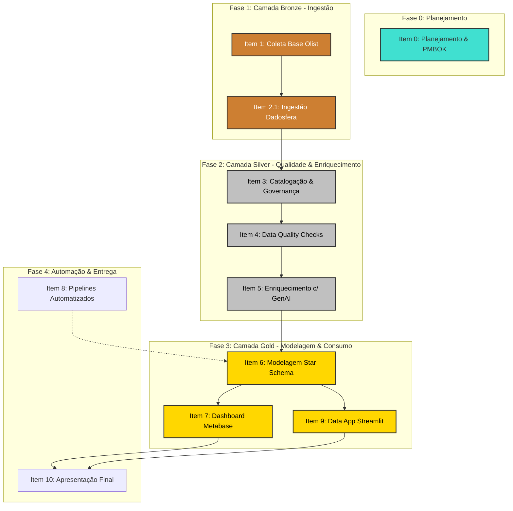

### Case Técnico Dadosfera – Engenharia de Dados

Autor: Ricardo Ribeiro
Data: Dezembro/2025
Contexto: Implementação de Plataforma de Dados End-to-End para E-commerce.

## Item 0: Planejamento e Agilidade

Este projeto adota uma abordagem híbrida, combinando planejamento estruturado com entregas incrementais, organizadas por fases de maturidade dos dados, do dado bruto ao consumo analítico.

A estrutura por fases facilita governança, rastreabilidade, escalabilidade e comunicação técnica do projeto.

## Fase 0 – Planejamento

Objetivo: Definir escopo, estrutura do repositório, metodologia e riscos do projeto.

| ID | Atividade | Estimativa | Status |
|----|-----------|------------|--------|
| 00 | Planejamento e Estruturação do Repositório | 1h | Concluído |

## Fase 1 – Bronze (Ingestão de Dados Brutos)

Objetivo: Garantir aquisição, rastreabilidade e persistência dos dados em estado bruto.

| ID | Atividade | Estimativa | Status | Dependência |
|----|-----------|------------|--------|-------------|
| 01 | Seleção e Aquisição de Dados (>100k rows) | 2h | Em andamento | 00 |
| 02 | Ingestão na Dadosfera (Carga + Microtransformação) | 3h | Pendente | 01 |

## Fase 2 – Silver (Qualidade, Governança e Enriquecimento)

Objetivo: Garantir consistência, qualidade, semântica e enriquecimento dos dados.

| ID | Atividade | Estimativa | Status | Dependência |
|----|-----------|------------|--------|-------------|
| 03 | Catalogação e Criação do Dicionário de Dados | 2h | Pendente | 02 |
| 04 | Análise de Qualidade de Dados (Data Quality) | 4h | Pendente | 03 |
| 05 | Processamento com GenAI (Criação de Features via LLM) | 5h | Pendente | 01, 02 |

## Fase 3 – Gold (Modelagem Analítica e Consumo)

Objetivo: Disponibilizar dados prontos para análise, visualização e produtos de dados.

| ID | Atividade | Estimativa | Status | Dependência |
|----|-----------|------------|--------|-------------|
| 06 | Modelagem de Dados Analítica (Star Schema) | 4h | Pendente | 04, 05 |
| 07 | Análise de Dados e Construção de Dashboard (Metabase) | 5h | Pendente | 06 |
| 09 | Desenvolvimento de Data Apps (Streamlit) | 6h | Pendente | 07 |

## Fase 4 – Automação e Entrega

Objetivo: Garantir reprodutibilidade, escalabilidade e comunicação dos resultados.

| ID | Atividade | Estimativa | Status | Dependência |
|----|-----------|------------|--------|-------------|
| 08 | Construção de Pipelines de Dados (Automação) | 4h | Pendente | 06 |
| 10 | Gravação e Preparação da Apresentação Final | 4h | Pendente | 00–09 |

## Análise de Riscos (Principais Pontos)

1. Rate Limit da API OpenAI
Mitigação por meio de processamento em batch, uso de backoff exponencial e controle de volume de requisições.

2. Qualidade e Consistência dos Dados
Mitigação por meio de validações automatizadas utilizando Great Expectations, aplicadas antes da persistência dos dados na plataforma.

## Estrutura do Projeto

1. 00_planejamento/
Documentação do planejamento, metodologia adotada e análise completa de riscos.

2. 01_base_dados/
Scripts de aquisição, amostras e dicionários da base de dados Olist (mais de 100 mil registros).

3. Demais diretórios serão adicionados progressivamente conforme o avanço do projeto e das entregas.

## Diagrama de Arquitetura do Case
Todo o case foi desenhado com base no Ciclo de Vida dos Dados adotado pela Dadosfera.
Cada fase do projeto se conecta diretamente a uma ou mais etapas desse ciclo,
desde a ingestão e processamento dos dados (Bronze),
passando pela qualidade, governança e enriquecimento (Silver),
até a modelagem analítica, consumo e Data Apps (Gold),
com IA Generativa integrada ao longo da cadeia de valor.

```mermaid
graph TD
    %% Estilos
    classDef bronze fill:#cd7f32,stroke:#333,stroke-width:2px,color:white;
    classDef silver fill:#c0c0c0,stroke:#333,stroke-width:2px,color:black;
    classDef gold fill:#ffd700,stroke:#333,stroke-width:2px,color:black;
    classDef plan fill:#40e0d0,stroke:#333,stroke-width:2px;

    subgraph Planejamento [Fase 0: Planejamento]
        I0[Item 0: Planejamento & PMBOK]:::plan
    end

    subgraph Bronze [Fase 1: Camada Bronze - Ingestão]
        direction TB
        I1[Item 1: Coleta Base Olist]:::bronze
        I2[Item 2.1: Ingestão Dadosfera]:::bronze
        I1 --> I2
    end

    subgraph Silver [Fase 2: Camada Silver - Qualidade & Enriquecimento]
        direction TB
        I3[Item 3: Catalogação & Governança]:::silver
        I4[Item 4: Data Quality Checks]:::silver
        I5[Item 5: Enriquecimento c/ GenAI]:::silver
        I2 --> I3
        I3 --> I4
        I4 --> I5
    end

    subgraph Gold [Fase 3: Camada Gold - Modelagem & Consumo]
        direction TB
        I6[Item 6: Modelagem Star Schema]:::gold
        I7[Item 7: Dashboard Metabase]:::gold
        I9[Item 9: Data App Streamlit]:::gold
        I5 --> I6
        I6 --> I7
        I6 --> I9
    end

    subgraph Final [Fase 4: Automação & Entrega]
        I8[Item 8: Pipelines Automatizados]
        I10[Item 10: Apresentação Final]
        I8 -.-> I6
        I7 --> I10
        I9 --> I10
    end
```
