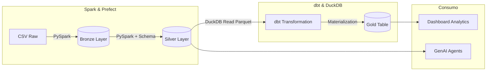
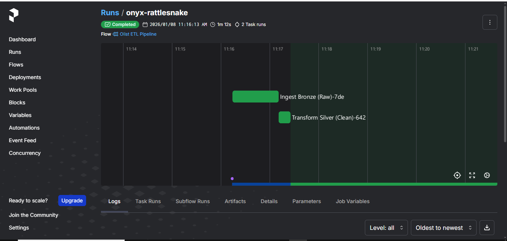
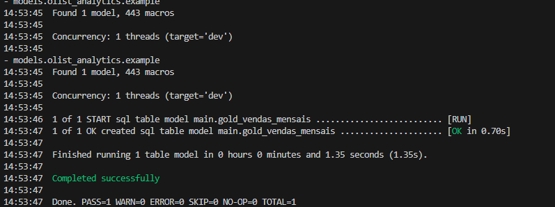

# Olist Modern Data Platform


**Autor:** Ricardo Ribeiro  
**Arquitetura:** Modern Data Stack (Lakehouse + Analytics Engineering)  
**Ambiente:** WSL 2 (Linux)

---

## Visão Geral: De Scripts Locais para Plataforma Escalável

Este projeto simula um ambiente de **Engenharia de Dados Produtivo**, desenhado para resolver problemas reais de escalabilidade e governança. 

A arquitetura foi refatorada para seguir as melhores práticas de mercado, migrando de scripts monolíticos para uma abordagem modular e orquestrada.

---

## Navegação por Fases do Projeto

Clique nos links abaixo para navegar pelos módulos e documentação específica de cada etapa.

| ID | Fase | Tecnologia | Onde está o código? |
| :-- | :--- | :--- | :--- |
| **00** | **Planejamento** | Kanban / Agile | [📂 00_planejamento](./00_planejamento/) |
| **01** | **Ingestão (Bronze)** | **PySpark** | [📂 src/etl](./src/README.md) |
| **02** | **Refinamento (Silver)** | **PySpark** (Schema Enforcement) | [📂 src/etl](./src/README.md) |
| **03** | **Analytics (Gold)** | **dbt + DuckDB** | [📂 olist_analytics](./olist_analytics/README.md) |
| **04** | **Orquestração** | **Prefect** | [📂 src/orchestration](./src/README.md) |
| **05** | **Data App & AI** | **Streamlit + GenAI** | [📂 09_data_app](./09_data_app/README.md) |

---

## Arquitetura da Solução

O fluxo de dados segue a arquitetura **Medallion**, utilizando o princípio de *"Right Tool for the Job"* (Ferramenta Certa para o Trabalho).


```mermaid
graph LR
    subgraph Ingestão & Processamento [Spark & Prefect]
        A[CSV Raw] -->|PySpark| B[(Bronze Layer)]
        B -->|PySpark + Schema| C[(Silver Layer)]
    end

    subgraph Analytics Engineering [dbt & DuckDB]
        C -->|DuckDB Read Parquet| D[dbt Transformation]
        D -->|Materialization| E[(Gold Table)]
    end

    subgraph Consumo
        E --> F[Dashboard Analytics]
        C --> G[GenAI Agents]
    end
```

---

## Detalhe das Camadas

* Bronze (Raw - Spark): Ingestão fiel dos dados brutos em formato Parquet.

*  Silver (Refined - Spark): Limpeza técnica, tipagem forte (StructType) e tratamento de nulos.

* Gold (Aggregated - dbt): Regras de negócio, KPIs mensais e agregações complexas gerenciadas via SQL modular no dbt.

---

## Tech Stack

| Tecnologia            | Função         | Justificativa Arquitetural                                                                                                                                           |
| --------------------- | -------------- | -------------------------------------------------------------------------------------------------------------------------------------------------------------------- |
| **Prefect**           | Orquestração   | Orquestra fluxos ETL de forma observável, com logs, retries automáticos e controle de execução, substituindo scripts manuais ou cron jobs.                           |
| **PySpark**           | Engine ETL     | Processamento distribuído e eficiente para grandes volumes de dados nas camadas **Bronze** e **Silver**, onde I/O e paralelismo são críticos.                        |
| **dbt + DuckDB**      | Transformações | DuckDB permite leitura instantânea de arquivos Parquet sem overhead de JVM, enquanto o dbt adiciona versionamento, linhagem, testes e documentação ao SQL analítico. |
| **WSL 2**             | Infraestrutura | Simula de forma fiel um ambiente Linux produtivo, mantendo compatibilidade com ferramentas modernas de dados no Windows.                                             |
| **Streamlit + GenAI** | Aplicação      | Camada de consumo voltada ao usuário final, com visualização interativa e uso de agentes de IA (Gemini / Stable Diffusion) para ativação e exploração de dados.      |


---

## Como Executar o Projeto
1. Setup do Ambiente

```Bash
# Clone o repositório
git clone [https://github.com/ricardoribs/RICARDO_RIBEIRO_DDF_TECH_122025.git](https://github.com/ricardoribs/RICARDO_RIBEIRO_DDF_TECH_122025.git)
```

# Instale as dependências
pip install -r requirements.txt

2. Iniciar o Orquestrador (Prefect)
Em um terminal, inicie o servidor local para visualizar os fluxos:

```Bash
prefect server start
# Acesse [http://127.0.0.1:4200](http://127.0.0.1:4200)´
```
3. Rodar o Pipeline de Dados (Bronze & Silver)
Em outro terminal, execute o fluxo:

```Bash
# Configura o cliente para o servidor local
prefect config set PREFECT_API_URL=[http://127.0.0.1:4200/api](http://127.0.0.1:4200/api)

# Roda a ingestão Spark
python3 src/orchestration/flow_main.py
```

4. Rodar a Camada de Analytics (Gold - dbt)
```Bash
cd olist_analytics
dbt run --profiles-dir .
```

---

## Evidências de Execução
### Orquestração com Prefect (Sucesso)
A imagem abaixo demonstra a execução bem-sucedida do fluxo no dashboard do Prefect, rodando em ambiente Linux (WSL) e gerenciando os jobs Spark.




### Transformação com dbt
Saída do terminal comprovando a materialização da tabela fato `gold_vendas_mensais` no DuckDB utilizando dbt.




---

<div align="center"> <h3>Desenvolvido por Ricardo Ribeiro</h3> <p>Engenheiro De Dados • Modern Data Stack</p> </div>